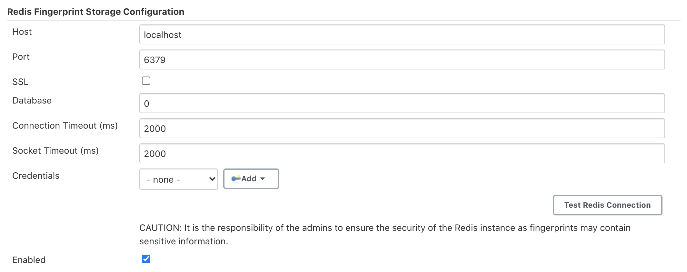

= Redis Fingerprint Storage Plugin

link:https://ci.jenkins.io/job/Plugins/job/redis-fingerprint-storage-plugin/job/master/[image:https://ci.jenkins.io/job/Plugins/job/redis-fingerprint-storage-plugin/job/master/badge/icon[Build]]
link:https://github.com/jenkinsci/redis-fingerprint-storage-plugin/graphs/contributors[image:https://img.shields.io/github/contributors/jenkinsci/redis-fingerprint-storage-plugin.svg?color=blue[Contributors]]
link:https://gitter.im/jenkinsci/external-fingerprint-storage[image:https://badges.gitter.im/jenkinsci/external-fingerprint-storage.svg[Gitter]]

This plugin is under development.
Please refer to https://www.jenkins.io/projects/gsoc/2020/projects/external-fingerprint-storage/[project page]
for current status.

== Introduction

The plugin allows users to use Redis for storing fingerprints.

== Running the plugin locally

Clone the repository

```
git clone https://github.com/jenkinsci/redis-fingerprint-storage-plugin
cd redis-fingerprint-storage-plugin
```

To obtain the `redis-fingerprint-storage.hpi` and `redis-fingerprint-storage.jar` files, run:
```
mvn clean install
```

They will be available inside `./plugin/target`.
(Note that docker is required for running tests.
If Docker is not installed, consider skipping tests)

To run the plugin on a local instance, run:

```
cd plugin
mvn hpi:run
```

== Configuring the plugin

Go to link:http://localhost:8080/jenkins/configure[Jenkins Configuration Page] (`/jenkins/configure`)



Supply the information for the server running Redis.

You can use the 'Test Redis Connection' button to verify that the details are correct.

All fingerprints will now be saved in the Redis instance, and not locally :)

== References

link:https://github.com/jenkinsci/jep/tree/master/jep/226[JEP-226]
