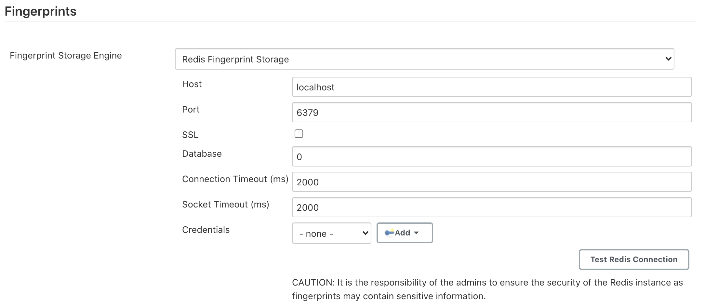

= Redis Fingerprint Storage Plugin

link:https://ci.jenkins.io/job/Plugins/job/redis-fingerprint-storage-plugin/job/master/[image:https://ci.jenkins.io/job/Plugins/job/redis-fingerprint-storage-plugin/job/master/badge/icon[Build]]
link:https://lgtm.com/projects/g/jenkinsci/redis-fingerprint-storage-plugin/context:java[image:https://img.shields.io/lgtm/grade/java/g/jenkinsci/redis-fingerprint-storage-plugin.svg?logo=lgtm&logoWidth=18[Language grade: Java]]
link:https://github.com/jenkinsci/redis-fingerprint-storage-plugin/graphs/contributors[image:https://img.shields.io/github/contributors/jenkinsci/redis-fingerprint-storage-plugin.svg?color=blue[Contributors]]
link:https://gitter.im/jenkinsci/external-fingerprint-storage[image:https://badges.gitter.im/jenkinsci/external-fingerprint-storage.svg[Gitter]]


== Introduction

The plugin allows users to configure Redis for storing fingerprints.

== Installation

The plugin can be installed using the Jenkins Update Center.

Follow along the following steps after running Jenkins to download and install the plugin:

. Select `Manage Jenkins`

. Select `Manage Plugins`

. Go to `Available` tab.

. Search for `Redis Fingerprint Storage Plugin` and check the box beside it.

. Click on `Install without restart`

The plugin should now be installed on your system.

== Configuring the plugin

=== Using the Web UI

Once the plugin has been installed, you can configure the Redis server details by following the steps below:

. Select `Manage Jenkins`

. Select `Configure System`

. Scroll to the section `Redis Fingerprint Storage Configuration` and fill in the required details:

+



+

* `Host` - Enter hostname where Redis is running

* `Port` - Specify the port on which Redis is running

* `SSL` - Click if SSL is enabled

* `Database` - Redis supports integer indexed databases, which can be specified here.

* `Connection Timeout` - Set the connection timeout duration in milliseconds.

* `Socket Timeout` - Set the socket timeout duration in milliseconds.

* `Credentials` - Configure authentication using username and password to the Redis instance.

. Use the `Test Redis Connection` to verify that the details are correct and Jenkins is able to connect to the Redis instance.

. Press the `Save` button.

. Now, all the fingerprints produced by this Jenkins instance should be saved in the configured Redis server!

=== Using Jenkins Configuration as Code Plugin (JCasC)

The plugin can also be configured using the link:https://github.com/jenkinsci/configuration-as-code-plugin[configuration as code plugin]

A sample YAML file is provided below for configuring this plugin using JCasC:

```
unclassified:
  fingerprints:
    storage:
      redis:
        host: "localhost"
        port: 6379
        ssl: false
        database: 0
        connectionTimeout: 3000
        socketTimeout: 3000
        credentialsId: "foo"
```

== Setting up the Plugin locally for Development

Clone the repository

```
git clone https://github.com/jenkinsci/redis-fingerprint-storage-plugin
cd redis-fingerprint-storage-plugin
```

To obtain the `redis-fingerprint-storage.hpi` and `redis-fingerprint-storage.jar` files, run:
```
mvn clean install
```

They will be available inside `./plugin/target`.
(Note that docker is required for running tests.
If Docker is not installed, consider skipping tests)

To run the plugin on a local instance, run:

```
cd plugin
mvn hpi:run
```

== Reaching Out

Feel free to reach out to us for any questions, feedback, etc. on the project's link:https://gitter.im/jenkinsci/external-fingerprint-storage[Gitter Channel] or the mailto:jenkinsci-dev@googlegroups.com[Jenkins Developer Mailing list]

We use Jenkins link:https://issues.jenkins-ci.org/[Jira] to track issues.
Feel free to file issues under `redis-fingerprint-storage-plugin` component.

== References

* link:https://github.com/jenkinsci/jep/tree/master/jep/226[JEP-226]

* link:https://www.youtube.com/watch?v=yzd-y5ByXg8&feature=youtu.be[Demo]

* link:https://www.jenkins.io/projects/gsoc/2020/projects/external-fingerprint-storage/[Project Page]
